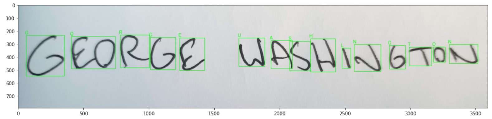

# Handwritten OCR for Write-In Resolution

Automation of the election write-in adjudication process via interpretable optical character recognition.

## Problem Domain

With growing scrutiny and a generally more engaged voting public, election jurisdictions in the US (and abroad) are under increasing pressure to deliver results in an expedient way.

Despite advancements in the technology used, modern elections are still a very labor-intensive undertaking. Areas that rely heavily on human labor, such as centralized ballot scanning and adjudication of ballots, have generally been the process components that are most expensive in terms of time.

Adjudication of ballots that can’t be read by an optical scanner — often ballots containing written names representing votes for write-in candidates — is an area that is particularly labor intensive.

Adjudication is a process whereby election judges (often several, representing two or more parties who are participating in the election) review ballots that can not be automatically resolved. The judges agree on a resolution and submit it to be included in the tally.

Ballots that can not be automatically resolved generally fall into one of three categories:
1.  Votes for write-in candidates
2.  Voting targets with mark density below a set detection threshold (ambiguous marks)
3.  Damaged ballots that cannot be scanned

Generally, there are two ways to manage write-in voting in US elections. Closed write-in rules dictate that a write-ins must be resolved to a qualified write-in candidate — a candidate who has applied and been approved to be a write-in for a particular contest. Open write-in rules allow for voters to write the name of anyone.

## Project Overview

For this project, I've tapped my experience working with election systems in the US and Canada to create a robust solution for the automatic adjudication of write-in votes. Because the majority of jurisdictions in North America that allow write-ins use the closed write-in system, this solution is built with that particular use case in mind.

In order to run this application, navigate to the project folder and run the following command:

`python local_app.py -i <path to input images folder> -o <path to results output folder> -c <candidate options separated by spaces>`

The input images should include only the write-in text. For the best results, the text should be printed in all capital letters. The application will produce two files in the results folder - **batch_results.csv** containing the tally and **unresolved.csv** containing the filenames of images that could not be resolved. Process images from unresolved inputs will also be placed in the results folder.

A demonstration of the functionality of this application is also available at https://share.streamlit.io/monolith1/handwritten-ocr-for-writein-resolution/main. This demonstration visualizes how the application performs classification. It also allows the user to see how the results vary based on different settings for the *minimum similarity score*.

## Repository Overview

This repository contains the following files:

├───data
│   ├───batch_test_images
│   ├───results
│   └───test_images
├───hist
├───model
├───.gitignore
├───app.ipynb
├───Basic_Modeling.ipynb
├───Basic_Modeling_AugInput.ipynb
├───Complex_Modeling.ipynb
├───local_app.py
├───README.md
├───requirements.txt
└───streamlit_app.py

The data folder contains:
* **batch_test_images:** A series of images used to test the batch processing functionality. Each image containins a handwritten write-in vote from one of four categories: Ramen, Pizza, Shawarma, and Spaghetti. There are 20 votes for each category, totaling 80 images.
* **results:** A folder containing results reports from both the online demo and from running **batch_test_images**.
* **test_images:** A folder containing handwritten images for general functionality testing.

**hist** contains the pickled model training history files, as well as a plot of training accuracy and loss vs. epoch, from each model tested. These are included for reference.
**model** contains each of the trained models. It is recommended to always use *Complex_PostZoomFix.h5*
There are four **.ipynb** files in the main directory. These were used for model and app development, respectively. They have been included for reference.
**local_app.py** is the main CLI application.
**streamlit_app.py** is the streamlit demo application.
**requirements.txt** contains the environment requirements to run the application.

NIST Special Database 19 is available at https://www.nist.gov/srd/nist-special-database-19

3. Detailed Explanation
	a. Modeling
	b. Candidate Resolution
4. Next Steps