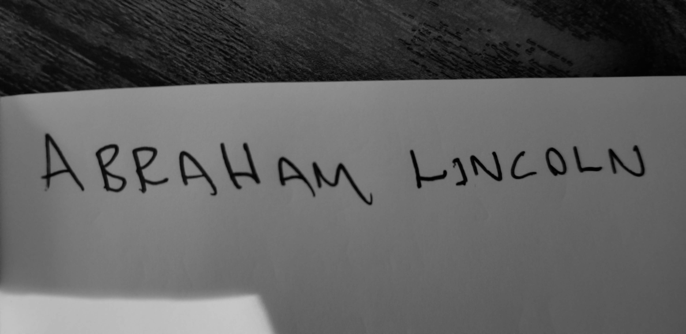
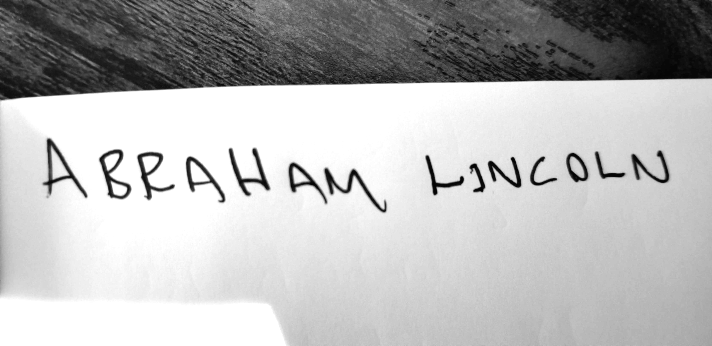
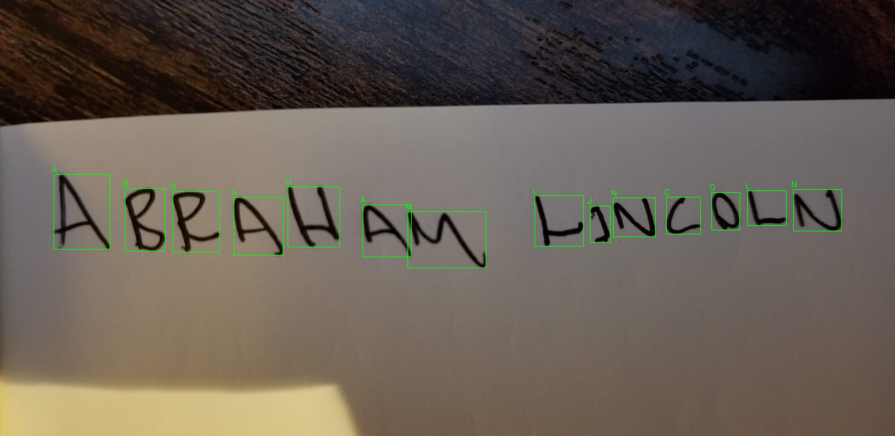

# Handwritten OCR for Write-In Resolution

Automation of the election write-in adjudication process via interpretable optical character recognition.


## Problem Domain

With growing scrutiny and a generally more engaged voting public, election jurisdictions in the US (and abroad) are under increasing pressure to deliver results in an expedient way.

Despite advancements in the technology used, modern elections are still a very labor-intensive undertaking. Areas that rely heavily on human labor, such as centralized ballot scanning and adjudication of ballots, have generally been the process components that are most expensive in terms of time.

Adjudication of ballots that can’t be read by an optical scanner — often ballots containing written names representing votes for write-in candidates — is an area that is particularly labor intensive.

Adjudication is a process whereby election judges (often several, representing two or more parties who are participating in the election) review ballots that can not be automatically resolved. The judges agree on a resolution and submit it to be included in the tally.

Ballots that can not be automatically resolved generally fall into one of three categories:
1.  Votes for write-in candidates
2.  Voting targets with mark density below a set detection threshold (ambiguous marks)
3.  Damaged ballots that cannot be scanned

Generally, there are two ways to manage write-in voting in US elections. Closed write-in rules dictate that a write-ins must be resolved to a qualified write-in candidate — a candidate who has applied and been approved to be a write-in for a particular contest. Open write-in rules allow for voters to write the name of anyone.

## Project Overview

For this project, I've tapped my experience working with election systems in the US and Canada to create a robust solution for the automatic adjudication of write-in votes. Because the majority of jurisdictions in North America that allow write-ins use the closed write-in system, this solution is built with that particular use case in mind.

In order to run this application, navigate to the project folder and run the following command:

`python local_app.py -i <path to input images folder> -o <path to results output folder> -c <candidate options separated by spaces>`

For example, to run the test batch images, you can use the command:

`python local_app.py -i data/batch_test_images -o data/results -c Ramen Pizza Shawarma Spaghetti`

The input images should include only the write-in text. For the best results, the text should be printed in all capital letters. The application will produce two files in the results folder - **batch_results.csv** containing the tally and **unresolved.csv** containing the filenames of images that could not be resolved. Process images from unresolved inputs will also be placed in the results folder.

A demonstration of the functionality of this application is also available at https://share.streamlit.io/monolith1/handwritten-ocr-for-writein-resolution/main. This demonstration visualizes how the application performs classification. It also allows the user to see how the results vary based on different settings for the [minimum similarity score](#similarity).


## Repository Overview

This repository contains the following files:

```
├───data  
│   ├───batch_test_images  
│   ├───results  
│   └───test_images  
├───hist  
├───model  
├───.gitignore  
├───app.ipynb  
├───Basic_Modeling.ipynb  
├───Basic_Modeling_AugInput.ipynb  
├───Complex_Modeling.ipynb  
├───local_app.py  
├───README.md  
├───requirements.txt  
└───streamlit_app.py
```  

The data folder contains:
* **batch_test_images:** A series of images used to test the batch processing functionality. Each image containins a handwritten write-in vote from one of four categories: Ramen, Pizza, Shawarma, and Spaghetti. There are 20 votes for each category, totaling 80 images.
* **results:** A folder containing results reports from both the online demo and from running **batch_test_images**.
* **test_images:** A folder containing handwritten images for general functionality testing. This folder also contains sample imagery referenced in this readme doc.

Also included in this repo:
* **hist** contains the pickled model training history files, as well as a plot of training accuracy and loss vs. epoch, from each model tested. These are included for reference.
* **model** contains each of the trained models. It is recommended to always use *Complex_PostZoomFix.h5*
* There are four **.ipynb** files in the main directory. These were used for model and app development, respectively. They have been included for reference.
* **local_app.py** is the main CLI application.
* **streamlit_app.py** is the streamlit demo application.
* **requirements.txt** contains the environment requirements to run the application.

## How does it work?

### Feature Extraction

When an image is passed to the application, it goes through several steps of preprocessing. Below, we will follow a single example through the preprocessing stage.

1. First, the image is converted to grayscale and a gaussian blur is applied to remove noise.

2. The image is then checked to see if it is bright enough to extract characters. If not, brightness is scaled up.

3. The image is converted to a threshold image by applying [Otsu's Thresholding](https://en.wikipedia.org/wiki/Otsu%27s_method). This separates the pixels in the image into two classes - background and foreground.

4. Using the threshold image, external contours of each character are found and isolated.

5. Contours are processed into 'boxes' - areas of the image that contain a single character. These boxes are passed through a size filter to ensure they are actual characters. The boxes are then passed to the classifier model for classification.


### Modeling

The model used for classifying extracted characters as letters was trained on the [NIST Special Database 19](https://www.nist.gov/srd/nist-special-database-19). The dataset contains 810,000 unique images of handwritten characters from 3600 unique writers. Initially, the dataset was fed unmodified to a simple [Multilayer Perceptron feed-forward artificial neural network](https://en.wikipedia.org/wiki/Multilayer_perceptron). This produced an impressive training accuracy of **99.6%**. However, when validated against data that the model hasn't seen, it produced a less satisfactory accuracy of **98.31%**. 


In order to get the model to generalize better to data that it hasn't seen, augmentation was applied to the training images. In other words, images were rotated, zoomed, shifted, and sheared in order to increase the variance in training data. Both training and validation accuracy were decreased, but the model was now able to generalize to new data.


Finally, in order to maintain both good accuracy and good generalization to new data, a more complex model was introduced. This model employs [Convolutional Neural Network](https://en.wikipedia.org/wiki/Convolutional_neural_network) layers in order to extract features from the characters presented to it, as well as [Long Short-term Memory](https://en.wikipedia.org/wiki/Long_short-term_memory) (a type of [Recurrent Neural Network](https://en.wikipedia.org/wiki/Recurrent_neural_network)) layers in order to contextualize feature sequences. By training on augmented input images as described above, the model was able to reach convergence between training and validation data. The final training accuracy was **99.37%** and the final validation accuracy was **99.43%**. Impressively, accuracy while testing on unseen NIST SD19 images reached **100%**.


 
Using the complex model trained on augmented input, predictions are made on each character image.



### <a name="similarity"></a> Candidate Resolution

By extracting the coordinates of each image during the feature extraction phase, the app orders the classified characters from left to right. These characters are joined in order to produce the classifications on string level, rather than character level. Inevitably, due to the amount of variance in handwritten text, some characters will be misclassified. The complete classification is compared against all of the valid candidates. This comparison is done using [Levenshtein Distance] - a method of comparing the similarity of two strings of characters. In this application, the distance has been normalized by sequence length in order to reduce sensitivity to longer sequences.

The normalized Levenshtein Distance is referred to in this app as the **similarity** between the presented candidate name and the possible candidate names. The app employs a **minimum similarity threshold**, whereby classifications must exceed a certain similarity score in order to be sent to tally. This is in response to a characteristic of the problem domain - **classifications made below a certain degree of certainty must be reviewed by a human, in order to maintain election integrity.**

If the presented candidate name shows a high degree of similarity to a possible candidate name, and that similarity is above the user set threshold, the classification is sent to tally. If the highest similarity score is not above the minimum similarity threshold, or two possible candidate names share the same similarity score, the model flags the image for human review.